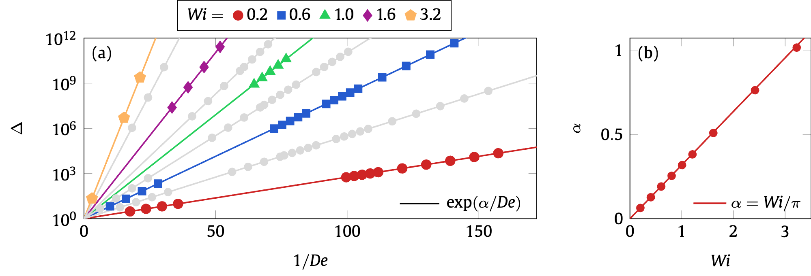

## Create Elsevier-style figures with XeLaTeX and TikZ/pgfplots

Make your Elsevier journal article figures match the rest of your printed article via XeLaTeX and TikZ. Like this:

Which is from [this paper](https://comp-physics.group/papers/bryngelson-EJM-19.pdf).

Examples:
* [example01.pdf](example01.pdf)
* [example02.pdf](example02.pdf)
* [example03.pdf](example03.pdf)
* [example04.pdf](example04.pdf)
* [example05.pdf](example05.pdf)
* [example06.pdf](example06.pdf)

### Dependencies

* XeLaTeX (comes with TeXLive and the like)
* TikZ and PGFPlots
* [Gulliver fonts](https://www.google.com/search?q=gulliver+font+download)

### License

MIT
